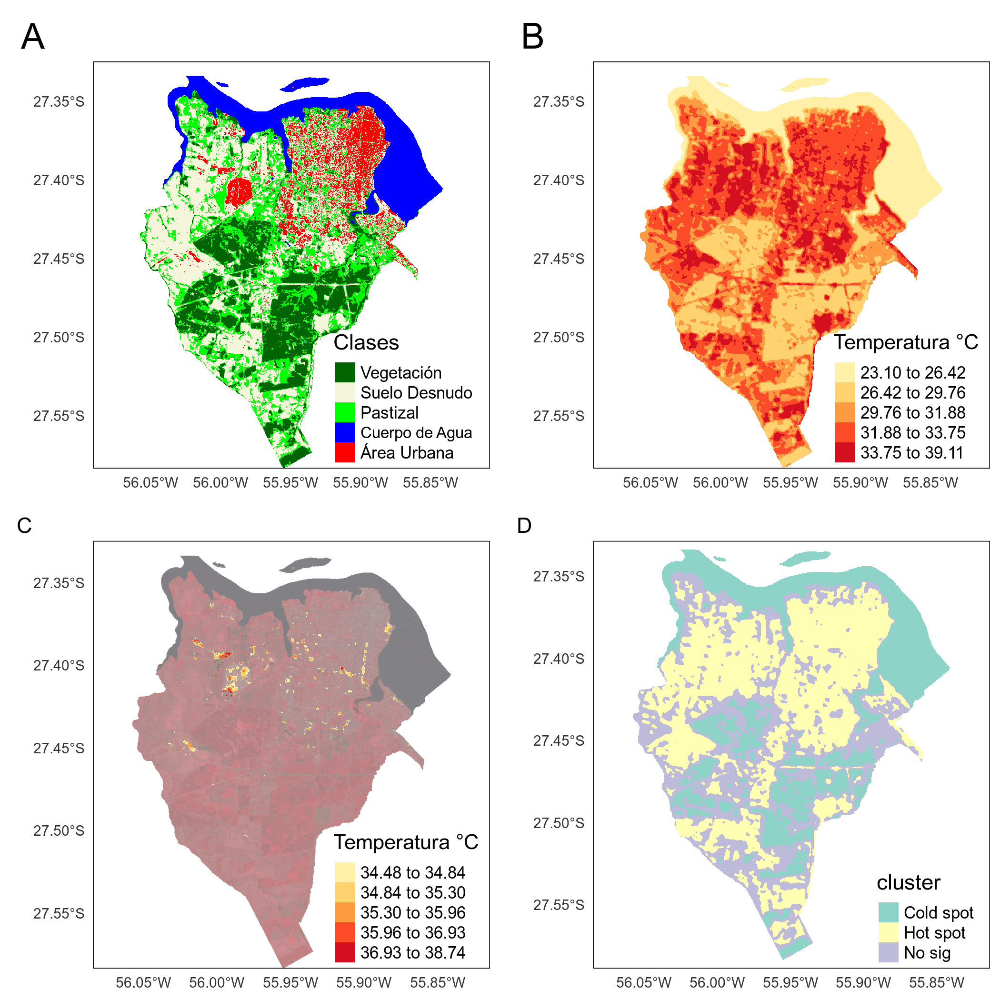

```{r setup, include=FALSE}
knitr::opts_chunk$set(echo = TRUE)
# library(RStoolbox)
library(readr)
library(pander)
library(ggplot2)
library(corrplot)
library(magrittr)
```

## RESUMEN:

Los estudios sobre este tema pueden ayudar a guiar la toma de decisiones y la implementación de políticas para crear ciudades más sostenibles y habitables en el futuro.

, y que la planificación urbana sostenible puede ser una herramienta efectiva para mitigar este efecto

Las ICU pueden tener efectos perjudiciales sobre la salud humana, el consumo de energía y el medio ambiente, lo que hace que su estudio y mitigación sean importantes para la planificación urbana sostenible.

Se pudo identificar, tal cual ya se esperaba, que el las temperaturas promedias en áreas construidas son X° más elevados que las áreas de bosque. Pero más allá de eso, se pudo percibir que el río Paraná comple un rol importante en el balance térmico por presentarse como un sumidero de las altas temperaturas. Como serguimiento, se sugiere replicar dicho estudio para todo el território de Msiones, y usando la seria historica de la misión LandSat.

**Palabras clave:** Islas de Calor Urbana; Servicios ambientales;

## Introducción  

Las Islas de Calor Urbana (Urban Heat Island - UHI, en inglés) son fenómenos observados en áreas urbanas que suelen experimentar temperaturas más altas que las áreas rurales circundantes, debido a los cambios en el paisaje, como el reemplazo de áreas verdes y suelos permeables con superficies pavimentadas y construcciones que absorben y retienen el calor. 

La relación entre la expansión urbana y la formación de islas de calor ha sido ampliamente estudiada (Zhou et al. en 2017 y Tan et al. en 2019), pricipalmente por medio de datos satelitales de temperatura de la superficie terrestre.

Lidentificación y mensuración de las islas de calor existentes es una herrameinta importante en la planificación urbana y ambiental dado sus efectos diredctos e indirectos en la calidad de vida de la población y por su intervención en los servicios ambientales que, según @DeGroot, se define como “flujo de bienes y servicios útiles para la sociedad humana” producidos por la naturaleza. Dentre tantos servicios está el de la regulación de la temperatura. Distintas investigaciones (Escobedo et al., 2011; Rahman et al., 2019, Li et al., 2019) lograron relacionar los servicios ecosistémicos que los bosques y espacios verdes urbanos pueden proporcionar a partir de la reducción del efecto de las islas de calor urbanas, mejorando la calidad de vida de la población. La comprensión de esta relación es importante para el desarrollo de políticas y estrategias de planificación urbana sostenible.

El presente trabajo hizo uso de imágenes satelitales para identificar sus potencialidades y límites en la identificación de las islas de calor urabanas en la ciudad de Posadas, Misiones, así como la cuantificación la temperatura en grados centígrados que puede llegar a haber entre los distintos tipos de uso de la tierra. En este sentido, se desarrollaron diferentes indicadores para analizar las islas de calor dependiendo de sus coberturas ofreciendo los resultados como un servicio ambiental.

## Área de estudio

El municipio de Posadas, capital de la provincia de Misiones (Argentina) se ubica a las orillas del río Paraná en el límite Argentina/Paraguay al sur de la provincia (figura \ref{mapaLocalizacao}).

```{r, echo = FALSE, out.width = "150px", fig.cap="Mapa de localización de Posadas, Misiones - Argentina. \\label{mapaLocalizacao}", fig.align='center'}
knitr::include_graphics("./plots/mapaLocalizacaoMod.png")
```

La mayor parte de la población de Posadas se encuentra en el perímetro del centro (figura \ref{mapaLocalizacao}, punto 1) siendo el centro limitado por otra parte por el río Paraná. La reciente expansión urbana es promovida por el estado provincial hacia el oeste con la construcción de unidades habitacionales edificados (figura \ref{mapaLocalizacao}, punto 2).

## Materiales y Métodos

```{r metadatosL8, echo=FALSE, eval=FALSE}
# Leer metadata
m <- list.files(path ="./raster/LC08_L1TP_224079_20201212_20201218_01_T1/", pattern ="_MTL.txt$", recursive = TRUE, full.names = TRUE)
m <- readMeta(m)
```

Para el presente estudio se utilizó el sensor ` OLI TIRS ` del  satélite `LANDSAT8` para la fecha `12/12/2020` y escena path/row `224/79`, haciendo uso del lenguaje de programación **R** [@rstats] y de los paquetes *raster* [@raster], *rstoolbox* [@rstoolbox], *lstoolbox* [@lstoolbox]. Dicha imagen fue utilizada para el análisis de cobertura del suelo así como para el análisis de islas de calor urbano.

La corrección atmosférica fue realizada usando el método de estimación de objetos oscuros y el algoritmo de *Simple dark object subtraction* - sdos [@rstoolbox]. Además de la corrección atmosférica, se realizó una corrección topográfica usando  el Modelo Digital de Elevación (DEM, en inglés) que cubre todo el municipio de Posadas (escenas `2757-29` y `2757-30`), descargados de la página del [Instituto Geográfico Nacional de Argentina (IGN)](https://www.ign.gob.ar/category/tem%C3%A1tica/geodesia/mde-ar).

Algunos indices espectrales fueron generados para apoyar a la clasificación de la cobertura del suelo, como el NDVI (*Normalized Difference Vegetation Index*), el EVI (*Enhanced Vegetation Index*) y el SAVI (*Soil Adjusted Vegetation Index*), que son ampliamente reconocidos por facilitar la identificación de áreas de vegetación, el índice NDWI (*Normalized Difference Water Index*) para auxiliar en la identificación de cuerpo de agua, el NDBI (*Normalized Difference Build Index*), por fin, fue utilizado para facilitar la identificación de áreas construidas (urbanas).

El análisis [*Within-Cluster-Sum of Squared Errors (WSS)*](https://medium.com/analytics-vidhya/how-to-determine-the-optimal-k-for-k-means-708505d204eb) fue utilizada para identificar la cantidad de clases disttintas que se pudiera diferenciar de manera a reducir significaficativamente el error *wws* (*within-cluster sum of squares*). En la figura \ref{quatromapas} (mapa A) se presenta el municipio de Posadas con el resultado de clasificación no supervisada de cobertura del suelo. Luego de la clasificación, se hizo la interpretación visual de las clases creadas, identificando: 1 - Vegetación; 2 - Suelo Desnudo; 3 - Pastizal; 4 - Cuerpo de Agua; 5 - Área Urbana;

Para identificar las Islas de Calor Urbano (*Spatial Urban Heat Island - SUHI*) (Oke, 1982), se calculó la temperatura superficial de la tierra (*Land Surface Temperature (LST)*) (Stathopoulou, 2007; USGS, 2019) (figura \ref{quatromapas}, mapa B) y, en base a eso, se pudo calcular las estadísticas de Islas de Calor Urbano (*Urban Heat Island (UHI)*)[@lstoolbox], en la cual se obtiene a cada clase de cobertura del suelo los valores de temperatura mínima, máxima, el promedio, la magnitud (su valor máximo menos el valor mínimo de temperatura), así como la diferencia de la temperatura promedio de la clase en relación a la clase de Área Urbana.

Se calculó el Área de Isla de Calor (*Heat Island Area (HIA)*) [@lstoolbox] y el indicador de correlación espacial  (*Local Indicators of spatial Association (LISA)*) considerando el indicador propuesto por *Getis-Ord Gi\** . El indicador de correlación espacial nos permitió identificar las áreas de agrupamiento sea entre altos valores de temperatura, ya sea de bajos valores de temperatura, así como aquellas con resultados no significativos (en base al valor *z.score* y la corrección *False Discovery Rate (FDR)*, la cual reduce el valor de corte del p-valor. Se usó el valor de 0.05 como el valor para rechazar la hipótesis nula).

```{r, echo = FALSE, out.width = "400px", fig.cap="Mapas de Land Surface Temperature (LST) para la ciudad de Posadas \\label{quatromapas}", fig.align='center'}

```

## Resultados y consideraciones finales

Al partir del cálculo de *LST* (figura \ref{quatromapas}, mapa B) se pudo percibir que mas allá de las áreas urbanas, áreas de Pastizal y Suelo Desnudo, presentaron elevado valor de temperatura. Aunque se haga siempre referencia a las áreas urbanas, ya es discutido por otros artículos (Jenerette, 2011; Herrmann, 2005; Imhoff, 2010) la contribución de otras coberturas del suelo (como suelos desnudos y áreas de pastizales) en la formación de las islas de calor urbanas. Se sugiere que eso resulta de su baja capacidad de retener la humedad y la alta reflectividad de la superficie. La falta de vegetación en estas áreas también reduce la sombra y la transpiración, lo que contribuye a un mayor calentamiento en el entorno urbano.

```{r, echo=FALSE}
tbl <- read.csv("./outputs/LC08_L1TP_224079_20201212_20201218_01_T1_sdos_clip_uhi_stats.csv")
```

Además, se pudo identificar que las áreas de `r tbl[which(tbl$min == min(tbl$min)), 'clase']` presentó valor mínimo de temperatura, con `r tbl[which(tbl$min == min(tbl$min)), 'min']` grados (tabla \ref{tab:MyLabel}) y la clase `r tbl[which(tbl$max == max(tbl$max)), 'clase']` presentó la temperatura máxima con `r tbl[which(tbl$max == max(tbl$max)), 'max']` grados. Puede ser que por el hecho del suelo de Misiones, y a su vez, Posadas, ser de tipo "rojo profundo", con prevalencia de *Ultisoles*, es responsable por esa características.

La amplitud de variación (en inglés *magnitud*, tabla \ref{tab:MyLabel}) de cada clase (valor máximo menos el valor mínimo de temperatura) es más grande en `r tbl[which(tbl$magnitud == max(tbl[-1, "magnitud"])), 'clase']`  totalizando `r tbl[which(tbl$magnitud == max(tbl[-1, "magnitud"])), 'magnitud']` grados. `r tbl[sort(tbl$magnitud, decreasing = T, index.return = T)$ix[2], 'clase']` tiene el segundo mayor valor de variación de temperatura con una amplitud de `r sort(tbl$magnitud, decreasing = T)[2]` grados. 

```{r uhiTable, echo=FALSE, results='asis'}
pander(tbl %>% dplyr::select(clase,min:magnitud), caption = "Estadísticas de UHI identificando para cada clase de cobertura del suelo los valores mínimos, máximos, medios y desvio estándar, así como la diferencia entre el valor promedio en relación al promedio de la clase urbana, y la magnitud de cambio de cada clase (su valor máximo menos el valor mínimo de temperatura)  \\label{tab:MyLabel}")
```

```{r, echo=FALSE}
hia <- read_rds("./outputs/LC08_L1TP_224079_20201212_20201218_01_T1_sdos_clip_hia")
```

El calculo de área de las islas de calor (indice *HIA*) fue calculado para las áreas urbanas y identificó `r hia[[4]]` grados como la "temperatura de corte" (valor límite) y `r hia[[2]]` grados como el valor promedio observado, lo que totalizó `r hia[[5]]` hectáreas de islas de calor urbano, en posadas (figura \ref{quatromapas}, mapa C) para la fecha analizada.

El mapa de índices *HIA* (figura \ref{quatromapas}, mapa C) muestra algunos puntos en la región oeste del municipio de la ciudad con altos valores (figura \ref{quatromapas}, punto 1). Lo inesperado fueron los índices bajos en el centro urbano de la ciudad (figura \ref{mapaLocalizacao}, punto 1), que se presumía ser equivalentes en términos de temperatura como las nuevas áreas de expansión urbana. Se sugiere que la ubicación del centro urbano en las cercanias del río Paraná ejerza influencia en la reducción de su temperatura, manteniéndola más baja si se comparada con las nuevas áreas de expansión urbana (figura \ref{mapaLocalizacao}, punto 2). Otros puntos que llaman la atención son: el hipermercado junto a la terminal de ómnibus y parte de la Avenida Quaranta (Ruta 12) (figura \ref{quatromapas}, mapa C - punto 2), Avenida Uruguay (figura \ref{quatromapas}, mapa C, punto 3) y la rotonda de la Avenida Costanera y Mitre (figura \ref{quatromapas}, mapa C, punto 4).

Con el resultado de análisis de correlación *G*\*  (figura \ref{quatromapas}, mapa D) se puede percibir que las áreas clasificadas como urbanas y de Suelo Desnudo tuvieron la tendencia a formar agrupamientos de puntos cálidos (*hot spot*). Además de eso, llama la atención el hecho de que además de las áreas de vegetación, el río Paraná se configura como un área disipadora de calor, o como se acostumbra a llamar, islas de calor negativa (*sink island*), sumideros de temperatura, un elemento fundamental en el equilibrio térmico del ecosistema urbano.

## Consideraciones finales

Los análisis presentados son un ejercicio exploratorio y de aproximación necesarios para evolucionar hacia las herramientas más avanzadas para el análisis de islas de calor urbano. Este ejercicio inicial, pudo identificar varios puntos importantes que deberían ser mejor investigados, como la necesidad de hacer el mismo estudio considerando una serie temporal. 

De esta manera, se podría intentar relacionar la tendencia observada en las áreas con cobertura de vegetación con la regulación climática. Quizás en el futuro, se podría prever el gasto en energía para el uso de aire acondicionado, para llamar atención hacia los servicios ecosistémicos de las áreas de vegetación.

Considerar en la planificación la contribución de los pastizales y suelos desnudos en la formación de las islas de calor urabno
resultados sugieren la importancia de considerar la cobertura de la superficie urbana en la planificación y diseño de ciudades más frescas y sostenibles.

# References

    Escobedo, F. J., Kroeger, T., & Wagner, J. E. (2011). Urban forests and pollution mitigation: Analyzing ecosystem services and disservices. Environmental Pollution, 159(8-9), 2078-2087.

    Rahman, A., Liu, Z., & Zhang, W. (2019). The impact of urbanization and green space change on the surface urban heat island in the Beijing metropolitan area. Journal of Environmental Management, 232, 401-411.

    Li, S., Li, P., Liu, J., & Li, Y. (2019). Spatial and temporal changes in ecosystem services and their relationships with land use in the Beijing–Tianjin–Hebei urban agglomeration from 2000 to 2015. Ecological Indicators, 104, 617-628.

    Oke, T. R. (1982). Spatial variations of urban heat island through the heterogeneity of the city landscape and surface coverage. Area, 14(3), 273-278. https://doi.org/10.1111/j.1475-4762.1982.tb00344.x
    
    Stathopoulou, M. and Cartalis, C. (2007). Daytime urban heat islands from Landsat ETM+ and Corine land cover data: An application to major cities in Greece. Sol. Energy. 81 358-368. 
    
    USGS. (2019). Landsat 8 data users handbook version 4. USGS Earth Resources Observation and Science (EROS). Sioux Falls, South Dakota. USA. 106. 
    
    Jenerette, G. D., Harlan, S. L., Buyantuyev, A., & Stefanov, W. L. (2011). Ecosystem services and urban heat riskscape moderation: Water, green spaces, and social inequality in Phoenix, USA. Ecological Applications, 21(7), 2637-2651. https://doi.org/10.1890/10-1191.1
    
    Herrmann, D. L., & Hutchinson, M. F. (2005). Rural–urban differences in the characteristics that influence surface urban heat islands. Journal of Applied Meteorology, 44(8), 1232-1245. https://doi.org/10.1175/JAM2261.1
    
    Imhoff, M. L., Zhang, P., Wolfe, R. E., & Bounoua, L. (2010). Remote sensing of the urban heat island effect across biomes in the continental USA. Remote Sensing of Environment, 114(3), 504-513. https://doi.org/10.1016/j.rse.2009.10.008