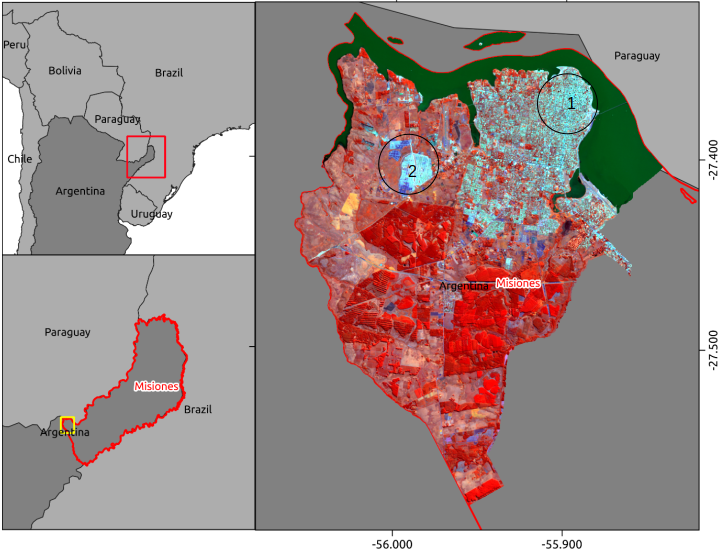
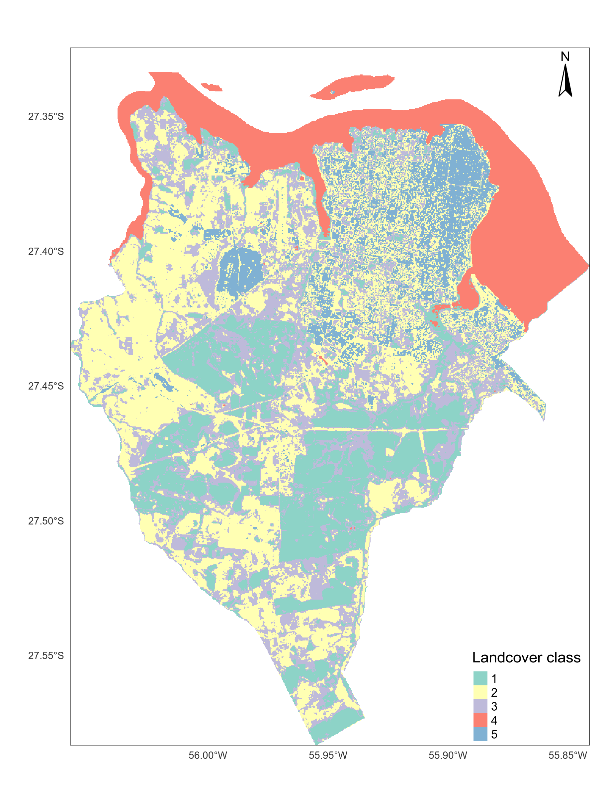
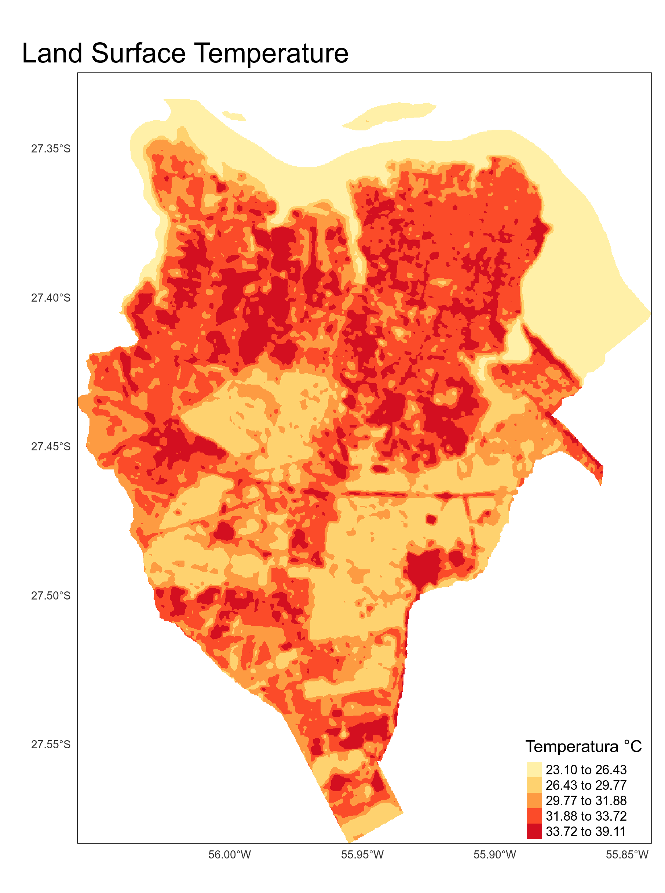
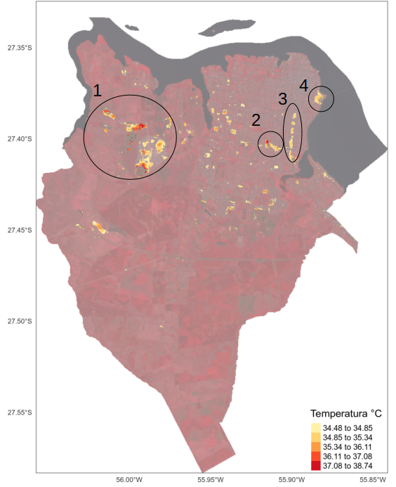
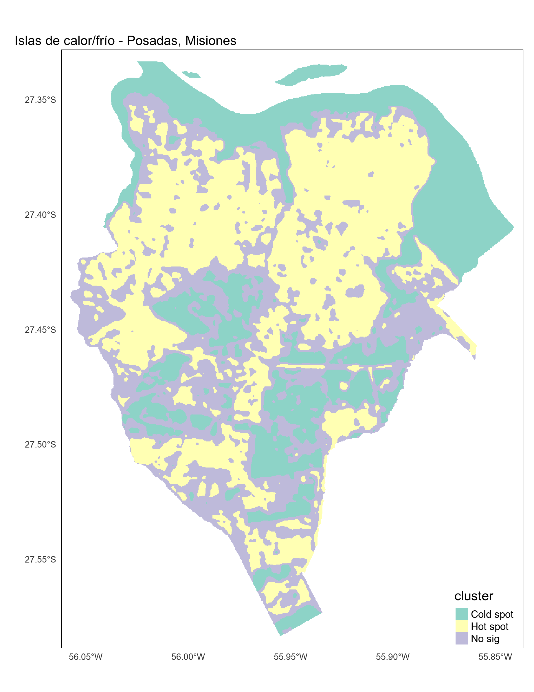

```{r setup, include=FALSE}
knitr::opts_chunk$set(echo = TRUE)
library(RStoolbox)
library(readr)
library(pander)
library(ggplot2)
library(corrplot)
library(magrittr)
```

## RESUMEN:
**Palabras clave:**

## Introducción  

**El proceso de expansión urbana y islas de calor**

**Qué son islas de calor?**

**Qué preguntas quiero responder?**

Se desarrollaron diferentes indicadores relacionados al análsis de islas de calor buscando, de alguna manera, identificar potencialidades y límites bien como entenderla bajo una otra mirada: como las diferentes coberturas del suelo están relacionadas a la temperatura observada por teledetección. Se buscará hacer una aproximación con el concepto de servicios ambientales, sin todavía preocuparse tanto en la validación científica de dicha relación (cobertura del suelo, temperatura observada, servicios ambientales). Por servicios ambientales se considera "flujo de bienes y servicios útiles para la sociedad humana", una definición cuñada por @DeGroot.

## Área de estudio

En el presente estudio, se analisó el municipio de Posadas, localizado en la provincia de Misiones - Argentina (figura \ref{mapaLocalizacao}). Dicha provincia es también conocida como "Mesopotamia" de Argentina ya que la misma se encuentra limitada por los dos ríos más importantes en escala regional: el río Paraná y el río Uruguay. Posadas está ubicada a orillas del río Paraná en el límite Argentina/Paraguay en la región sur de la provincia (figura \ref{mapaLocalizacao}).

```{r, echo = FALSE, out.width = "300px", fig.cap="Mapa de localización de Posadas, Misiones - Argentina. \\label{mapaLocalizacao}", fig.align='center'}

```


La ciudad de Posadas posee algunas características interesantes como ciudad, ya que posee un centro urbano en las cercanías del río Paraná (punto 1, figura \ref{mapaLocalizacao}), pero con la mayor parte de su población viviendo en el perímetro del centro y un proceso reciente de expansión urbana hacia el oeste de la ciudad con la construcción de barríos de unidades habitacionales edificados por el estado provincial guiando su ocupación hacia dicha dirección (punto 2, figura \ref{mapaLocalizacao}).

## Materiales y Métodos

```{r metadatosL8, echo=FALSE}
# Leer metadata
m <- list.files(path ="./raster/LC08_L1TP_224079_20201212_20201218_01_T1/", pattern ="_MTL.txt$", recursive = TRUE, full.names = TRUE)
m <- readMeta(m)
```

Para el presente estudio se utilizó el sensor `r m$SENSOR` del  satélite `r m$SATELLITE[1]` para la fecha `r m$ACQUISITION_DATE[1]` y cena path/row `r m$PATH_ROW[1]`/`r m$PATH_ROW[2]`, haciendo uso del lenguaje de programación **R** [@rstats] y de los paquetes *raster* [@raster], *rstoolbox* [@rstoolbox], *lstoolbox* [@lstoolbox]. Esta misma imagen fue utilizada para el análisis de cobertura del suelo así como para el análisis de islas de calor urbano.

### Preprocesamiento

Para la corrección atmosférica se utilizaron los métodos de estimación de objetos oscuros y el algoritmo de *Simple dark object subtraction* - sdos [@rstoolbox]. Para la corrección topográfica, se descargó de la página del [Instituto Geográfico Nacional de Argentina (IGN)](https://www.ign.gob.ar/category/tem%C3%A1tica/geodesia/mde-ar) las cenas de Modelo Digital de Elevación (DEM, en inglés) que cubre todo el municipio de Posadas (cenas `2757-29` y `2757-30`).

Para apoyar a la clasificación de la cobertura del suelo, algunos índices espectrales fueron creados, como el NDVI (*Normalized Difference Vegetation Index*), el EVI (*Enhanced Vegetation Index*) y el SAVI (*Soil Adjusted Vegetation Index*) para facilitar la identificación de áreas forestales o con actividad de fotosíntesis. Considerando la presencia de cuerpos de agua se utilizó el índice NDWI (*Normalized Difference Water Index*). Ya el índice NDBI (*Normalized Difference Build Index*) fue utilizado para facilitar la identificación de áreas construidas.

### Clasificación cobertura del suelo

Para la clasificación de cobertura del suelo, de utilizó el análisis [*Within-Cluster-Sum of Squared Errors (WSS)*](https://medium.com/analytics-vidhya/how-to-determine-the-optimal-k-for-k-means-708505d204eb). Con este análisis se pudo identificar que el área sería mejor mapeada con cinco clases por ser la primera cantidad de clases a reducir el *WSS error* de manera significativa. En la figura \ref{resultadoclass} se presenta el municipio de Posadas con el resultado de clasificación no supervisada de cobertura del suelo. Luego de la clasificación, se hizo la intepretación visual de las clases creadas: 1 - Florestas; 2 - Suelo Expuesto; 3 - Pastizales; 4 - Agua; 5 - Área Urbana;

```{r, echo = FALSE, out.width = "200px", fig.cap="Resultado de la clasificación no supervisada, con las clases: 1 - Floresta; 2 - Pastizales; 3 - Suelo Expuesto; 4 - Agua; 5 - Área Urbana; \\label{resultadoclass}", fig.align='center'}

```

### Análisis de Islas de Calor Urbano

Para se identificar las Islas de Calor Urbano (*Spatial Urban Heat Island - SUHI*), se calculó el la temperatura superficial de la tierra (*Land Surface Temperature (LST)*) (figura \ref{lst}) [@lstoolbox] y, en base a él, se pudo calcular las estadísticas de Islas de Calor Urbano (*Hurban Heat Island (UHI)*), en la cual se obtiene a cada clase de cobertura del suelo los valores de temperatura mínima, máxima, el promedio, la magnitud (su valor máximo menos el valor mínimo de temperatura), así como la diferencia de la temperatura promedio de la clase en relación a la clase de Área Urbana.

En seguida se calcuó el Área de Isla de Calor (*Heat Island Area (HIA)*) [@lstoolbox] y el indicador de correlación espacial  (*Local Indicators of spatial Association (LISA)*) considerando el indicador propuesto por *Getis-Ord Gi\** . El indicador de correlación espacial nos permitió identificar las áreas de agrupamiento sea entre altos valores de temperatura, ya sea de bajos valores de temperatura, así como aquellas con resultados no significativos (en base al valor *z.score* y la corrección *False Discovery Rate (FDR)*, la cual reduce el valor de corte del p-valor. Se usó el valor de 0.05 como el valor para rechazar la hipótesis nula).

```{r, echo = FALSE, out.width = "200px", fig.cap="Mapas de Land Surface Temperature (LST) para la ciudad de Posadas \\label{lst}", fig.align='center'}

```

## Resultados y conclusiones

El resultado del cáculo de *LST* (figura \ref{lst}) nos llamó la atención por el hecho de las áreas de mayor temperatura no seren, necesariamente, las areas clasificadas como urbanas, pero también áreas clasificadas como Pastizales y Suelo Expuesto.

```{r, echo=FALSE}
tbl <- read.csv("./outputs/LC08_L1TP_224079_20201212_20201218_01_T1_sdos_clip_uhi_stats.csv")
```

Analizando las estadísticas de *UHI* (tabla \ref{tab:MyLabel}), se pudo identificar que, para la cena utilizada, la clase `r tbl[which(tbl$min == min(tbl$min)), 'clase']` presentó el menor valor mínimo de temperatura, con `r tbl[which(tbl$min == min(tbl$min)), 'min']` grados. Ya la clase `r tbl[which(tbl$max == max(tbl$max)), 'clase']` presentó el mayor valor de temperatura máxima con `r tbl[which(tbl$max == max(tbl$max)), 'max']` grados. Este último resultado confirma lo mencionado inicialmente: áreas de mayor temperatura de superficie no fueron, necesariamente, áreas clasificadas como "Área Urbana". Puede ser que por el hecho del suelo de Misiones, y a su vez, Posadas, ser de tipo "rojo profundo", con prevalencia de *Ultisoles*, sea responsable por esa características.

Con relación a la magnitud (tabla \ref{tab:MyLabel}), que mide el rango de variación de cada clase (valor máximo menos el valor mínimo de temperatura), se evidencia en áreas de `r tbl[which(tbl$magnitud == max(tbl[-1, "magnitud"])), 'clase']` el mayor rango de variación, totalizando `r tbl[which(tbl$magnitud == max(tbl[-1, "magnitud"])), 'magnitud']` grados. Las áreas de `r tbl[sort(tbl$magnitud, decreasing = T, index.return = T)$ix[2], 'clase']` se presentan como la clase con el segundo mayor valor de variación de temperatura con un rango de `r sort(tbl$magnitud, decreasing = T)[2]` grados. 

```{r uhiTable, echo=FALSE, results='asis'}
pander(tbl %>% dplyr::select(clase,min:magnitud), caption = "Etadísticas de UHI identificando para cada clase de cobertura del suelo los valores mínimos, máximos, medios y desvio estándar, así como la diferencia entre el valor promedio en relación al promedio de la clase urbana, y la magnitud de cambio de cada clase (su valor máximo menos el valor mínimo de temperatura)  \\label{tab:MyLabel}")
```

```{r, echo=FALSE}
hia <- read_rds("./outputs/LC08_L1TP_224079_20201212_20201218_01_T1_sdos_clip_hia")
```

El cáculo de *HIA* fue desarrollado considerando solamente las áreas de clase urbana, aunque se puede percibir en la figura \ref{lst} que las áreas de mayor temperatura no están restrictas a áreas de dicha clase. El índice de HIA retornó como limitar de temperatura `r hia[[4]]` grados, con valor promedio de `r hia[[2]]` grados y totalizando `r hia[[5]]` hectáreas de islas de calor urbana, presentadas en la figura \ref{hiamapMod}.

El mapa de HIA (figura \ref{hiamapMod}) deja en evidencia algunos puntos de la ciudad como los barríos de vivienda que se están consolidando en la región oeste del municipio (punto 1, figura \ref{hiamapMod}). Lo inesperado fue la ausencia del centro urbano (punto 1, figura \ref{mapaurbano}), el cual se presumía ser tan significativo en términos de temperatura como las nuevas áreas de expansión urbana. Habría que investigar más al respecto, pero el hecho de dicho centro urbano estar ubicado cerca el río Paraná puede estar influenciando en su temperatura, manteniendo más baja si se compara con las nuevas áreas de expansión urbana (punto 2, figura \ref{mapaurbano}). Otros puntos interesantes para mencionar son: el hipermercado libertad junto a la terminal de ómnibus y parte de la Avenida Quaranta (Ruta 12) (punto 2, figura \ref{hiamapMod}), Avenida Uruguay (punto 3, figura \ref{hiamapMod}) y la rotonda de la Avenida Costanera y Mitre (punto 4, figura \ref{hiamapMod}).

```{r, echo = FALSE, out.width = "300px", fig.cap="Mapa del análisis Heat Island Area (HIA) con algunos puntos de atención. \\label{hiamapMod}", fig.align='center'}

```

Con el resultado del análisis de correlación *G*\*  (figura \ref{correlacionG}) se puede percibir que, para la fecha de la imagen analizada y para el municipio de Posadas, las áreas clasificadas como urbanas y de Suelo Expuesto tuvieron la tendencia a formar agrupamientos de puntos cálidos (*hot spot*). Además de eso, llama la atención el hecho de que además de las áreas florestales, el río Paraná se configura como un área disipadora de calor, o como se acostumbra a llamar, islas de calor negativa (*sink island*).

```{r, echo = FALSE, out.width = "200px", fig.cap="Mapa correlación espacial a partir del índice G*, indicando áreas de cold/hot spot y áreas sin resultado de correlación significativo. \\label{correlacionG}", fig.align='center'}

```

## Consideraciones finales

Los análisis desarrollados para este artículo se mostraron como un ejercicio exploratorío y de aproximación necesarios hacia las herramientas disponíbles para el análisis de islas de calor urbano. Aunque se trata de un ejercicio inicial, se pudo identificar, en este prototípo, varios puntos importante a ser mejor investigados, como la necesidad de hacer el mismo estudio considerando una serie temporal. De esta manera se podrá identificar si la tendencia encontrada en este ejercicio se mantiene en un contexto histórico.

De esta manera, se podría intentar relacionar la tendencia observada en las áreas de cobertura florestal con la regulación climática. Quizás en el futuro, se podría, incluso, estimar el gasto en energía para llegar a la misma temperatura con el uso de aire acondicionado, para llamar atención hacia los servicios ecosistémicos de las áreas florestales.

# References