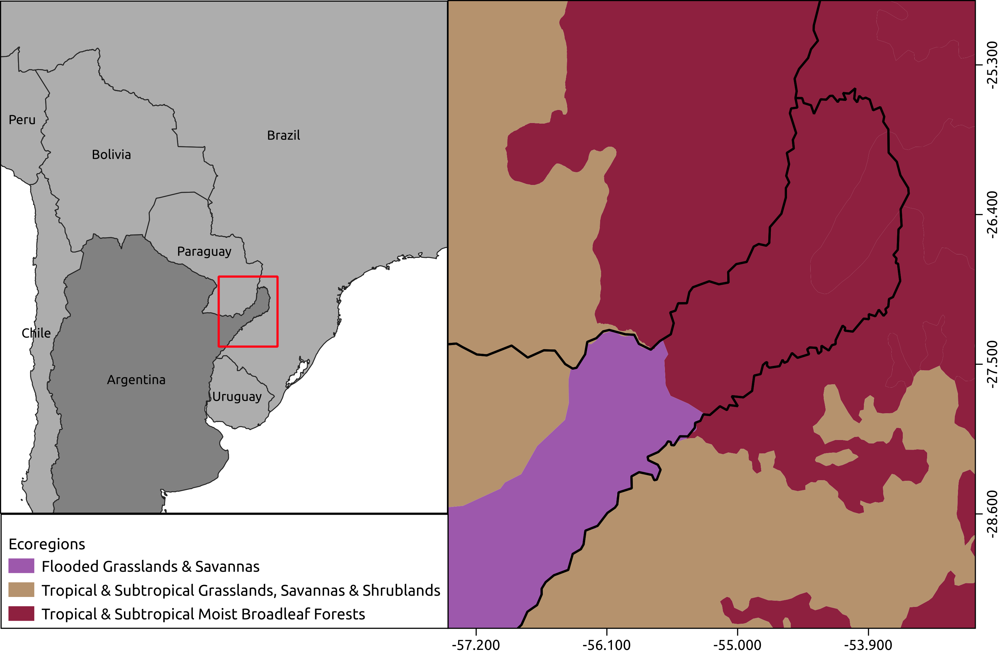
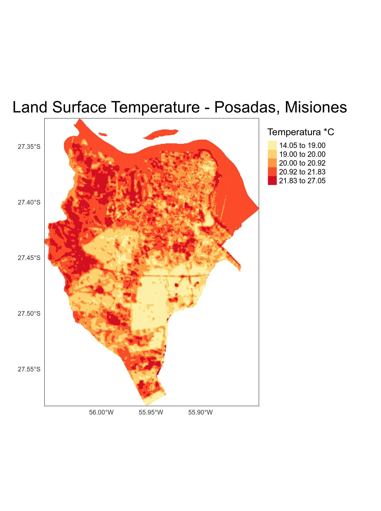

```{r setup, include=FALSE}
knitr::opts_chunk$set(echo = TRUE)
library(RStoolbox)
library(readr)
```

## Introducción  

En el presente informe se pretende plasmar los conocimientos adquiridos en el curso-taller **"Análisis de islas de calor urbano empleando el paquete `LSTtools` en R"** a cargo del Dr. Richard Lemoine-Rodriguez.

La idea es explorar las herramientas y análsis de islas de calor de manera experimental para, de alguna manera ya ir identificando potencialidades y límites en el uso de dichas herramientas. Lo que se busca es articular la información y conocimiento adiquirido por los análisis de Islas de Calor con los conceptos de servicios ambientales. 

Por servicios ambientales se considera "flujo de bienes y servicios útiles para la sociedad humana", una definición cuñada por (\ref{}De Groot, 1987). En el presente estudio, se pretende analisar los efectos de las forestas en el servicio ambiental de regulación, más esécíficamente regulación climática por, supuestamente favoreces las condiciones favorables de temperatura.

Ya que no dispongo de todos los materiales para el análsisis completo, buscaré desarrollar los materiales que sean necesário y que agreguen conocimientos a los resutados, como por ejemplo, un mapa de cobertura de la tierra.

## Descripción del área y ciudad de estudio

En el presente estudio, se hará un análisis para el municipio de Posadas, localizado en la provincia de Misiones - Argentina (\ref{mapaLocalizacao}). Dicha provincia es también conocida como "mesopotamia" de Argentina ya que la misma se encuentra limitada por los dos ríos más inportantes en escala regional: el rio Paraná y el rio Uruguay. Posadas, en este sentido está ubicada en las orillas del rio Paraná en el límite Argentina/Paraguay en la región sur de la provincia.


Se trata de un municipio en área de transición de tres biomas (\ref{mapaVegetacion}): *Grasslands & Savannas* (conocido localmente por "Campos y Malezales");  *Tropical & Subtropical Grasslands, Savanna & Shrublands* ("Esteros del Iberá");  *Topical & Subtropical Moist Broadleaf forests* ("Selva Paranaense"). Posee clima subtropial sin estación seca.



## Materiales

### datos satelitales:
```{r metadatosL8, echo=FALSE}
# Leer metadata
m <- list.files(path ="./raster/LC08_L1TP_224079_20200518_20200527_01_T1", pattern ="_MTL.txt$", recursive = TRUE, full.names = TRUE)
m <- readMeta(m)
```

Para el presente estudio se utilizó el sensor `r m$sensor[1]` del  satelite `r m$SATELLITE[1]` para la fecha `r m$ACQUISITION_DATE[1]` y cena path/row `r m$PATH_ROW[1]`/`r m$PATH_ROW[2]`.

Esta misma imagen fue utilizada para el análisis de cobertura de la tierra bien como para el análisis de islas de calor urbano.

## Métodos

El primer paso que se hizo fue el preprocesamiento ya que el resultado del mismo será utilizado en todos los análisis. El mismo fue desarrollado a partir del script [*01_proprocessing*](./Scripts/01_preprocesing.R) ubicado en la carpeta 'scripts'.

### Preprocesamiento
1. Corrección atmosférica y calibración radiométrica;
1. Corrección topográfica:
  1. Mosaico de las cenas DEM 30 metros;
1. Indices espectrales:
  1. NDVI;
  1. NDWI;
  1. NDBI;

Las correcciones atmosfericas y calibración radiompetricas se utilizaron las informaciones presentes en el metadato del censor. La corrección atmosferica, en específico se utilizó el método `sdos`. Ya con relación a la corrección topográfica, se descargó de la pagina del [Instituto Geográfico Nacinal de Argentina (IGN)](https://www.ign.gob.ar/category/tem%C3%A1tica/geodesia/mde-ar) las cenas de Modelo Digital de Elevación (DEM, en inglés) que cubre todo el minicípio de Posadas. Para eso, fue necesário hace el mosaico de las cenas `2757-29` y `2757-30`, bien como proyectar el raster al mismo Sistema de Referencia de Coordenadas (SRC) de la imagem landsat (todos los procedimientos, están plasmados en el script [*01_preprocessing_dem*](./Scripts/01_preprocessing_dem.R)).

La idea de usar algunos indices espectrales para apoyar a la clasificación de la cobertura de la tierra y análisis de servicios ambientales se justifica pela presencia de áreas de foresta densa en la región (tanto nativas como plantadas), por eso el uso del NDVI, y presencia del rio Paraná, justificando el uso del NDWI. El NDBI fue utilizado para facilitar el análisis de la influencia de áreas construidas;

### Clasificación cobertura de la tierra

Considerando los datos satelitales ya preprocesados, se desarrolló los siguintes etapas para la clasificación de cobertura del suelo:

1. Definición de cantidad de clases;
1. entrenamiento del modelo `Kmeans`;
1. Predicción;

La definición de la cantidad de clases se hizo por análisis visual de la imagen considerando el conocimineto del área. De esta forma se optó por la clasificación en 5 clases distantas (\ref{cobtierra}):

1. Herbacea / pasto;
1. Agua;
1. Floresta;
1. Solo expuesto;
1. Area urbana;

Vários metodos podrían haber sido utilizados de forma a tornar dicha definición más 'científica'/menos subjetiva, pero por la falta de tiempo, los mismos quedarán para otro momento. Los procedimientos desarrollados están en el script [*02_land_cover*](./Scripts/02_land_cover.R).


### Análisis de Islas de Calor Urbano

1. Calculo de emissividad
1. Calculo de LST - *Land Surface Temperatura*  
1. Calculo de estadísticas de UHI - *Urban Heat Island*
1. Análisis de HIA - *Heat Island Areas*
1. Análisis de LISA - *Local Indicators of Spatial Associtation*

Considerando los objetivos del presete trabajo, so optó por la no realización del calculo de Islas de Calor Urbano Espaciales (SUHI - *Spatial Urban Heat Island*).

En el calculo de emissividad (\ref{emissivity}), se consideraron los valores estándar de los parámetros por falta de conocimiento y medición local.


## Resultados

En base a la emissividad se calculó *Land Surface Temperature* (\ref{lst}). El resultado me pareció raro por apresentar algunos valores que yo no esperaba como: área de água (rio Paraná) con valores de temperatura mayores que la temperatura de la ciudad; Además de eso, las temperaturas de área urbana más bajas que de áreas de suelo expuesto.


Al calcular las estadísticas de Islas de Calor Urbano para el município de Posadas (\ref{uhi}), se pudo identificar una diferencia pormedia de casi dos grados entre área forestal y área urbana;
Algunos puntos que me llamó atención, fueron:

* Promedio de area urbana es menor que promedio de suelo expuesto y agua;
* La mayor variación en temperatura encontrada fue en Area urbana;
* La menor variabilidad de teperatura fue en la clase agua;
* Herbacea y pasto tivueron variación de temperatura similar a la de la clase de foresta;

```{r uhi, echo = FALSE, message=FALSE}
uhi <- read_csv("./outputs/uhi_stats.csv")
knitr::kable(uhi, caption = "Estadísticas de islas de calor urbana",  align = "l", position = "c", padding = 0)
```

Los análisis de Areas de Islas de Calor (\ref{hia}) deja en evidencia algunos puntos de la ciudad como Aeropuerto y áreas de expansión urbana que por un lado ya eran esperados pero de manera inesperada, deja de fuera el centro urbano, el cual se imaginaba se mucho más significativo en términos de calor.


```{r read_hia, echo=FALSE, message=FALSE}
hia <- read_csv("./outputs/hia.csv")
```

El valor medio de calor fue de `r hia$Mean`°C  con deviación estándar de `r hia$SD`. El limiar de corte fue de `r hia[,3]`°C y representa la suma total de `r hia[,4]` hectareas para todo el município.

Buscando identificar la relación entre foresta, áreas de água y de construcción y temperatura, se realizó craficos de dispersión de los respectivos indices espectrales en función de los valores de temperatura de superficie de la tierra:

El análisis de relación lineal entre LST y NDVI (\ref{LASTXNDVI}) presentó una relación inversa, pero de baja relación. Lo interesante fue que, al usar un modelo GAM, luego, no lineal, se pudo percibir que para valores de NDVI mayores a 0.6 la relación me muestra bastante fuerte (\ref{LASTXNDVIGAM}).


El indice de água presenta una relación bastante similar al NDVI en sentido de no presentar tanta fuerza de relación y la misma ser inversa, con mayor valor de indice de água, la tendencia es tener menor temperatura.


Con relación al indice de área construida (\ref{LSTXNDBI}), la relación es inversa y un poco más accentuada.


El valor de z estandarizado para Local Gery G* presenta algunos puntos de baja correlación de temperatura y outros de alta correlación de temperatura. as parameters 70 meters.


## Consideraciones finales

Los análsisis desarrollados para este informe se mostraron como un buen ejercício de aproximación a toda complejidad de calculo y análsisis a ser considerado. Creo que los resultados obenidos no fueron tán satisfatorios por dos posibles problemas:

1. Ausencia de un datos de cobertura de la tierra bien elaborado y con validación;
1. Posible inconsistencia en la imagen, principalmente en lo concerniente a las áreas de água, o quizás infomración associada a la fecha de la imagen que nos permita identificar los motivos por los cuales áreas de água figuran con mayor temperatura de áreas de contrucción. Una razón posible sería habe llovido días antes y, con eso, aumentando la concentración de particulados del água y la reducción de la temperatura de áreas de contrucción. Este fenómeno también puede haber sido motivado por se tratar de un período de primavera.

Pero más allá de eso se puedo entender los procedimeintos y algunos reusltados se presentaron oertinente como la diferencia promedia de temperatura entre areas forestales y áreas urbanas y la magnitud de diferencia entre ellas, respectivamente de aproximadamente 2° y 3° celsius menos en área de foresta.