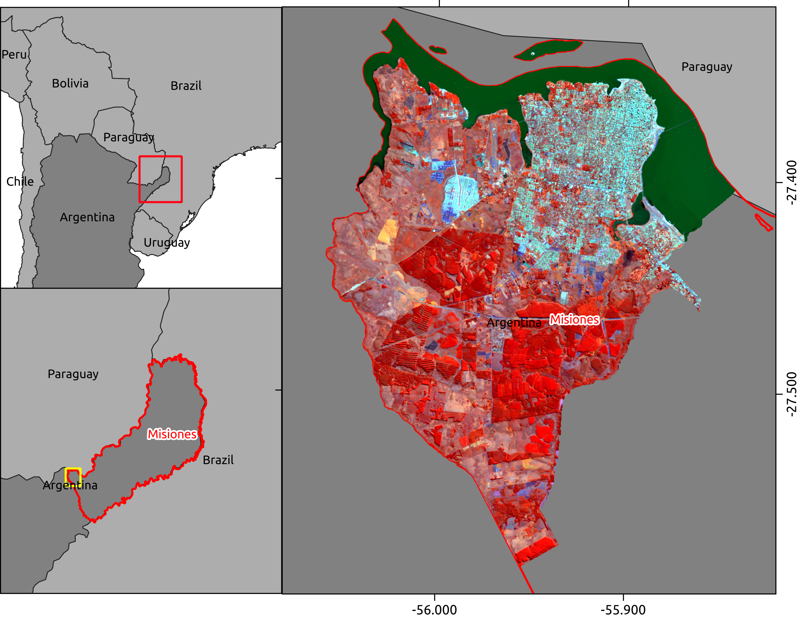
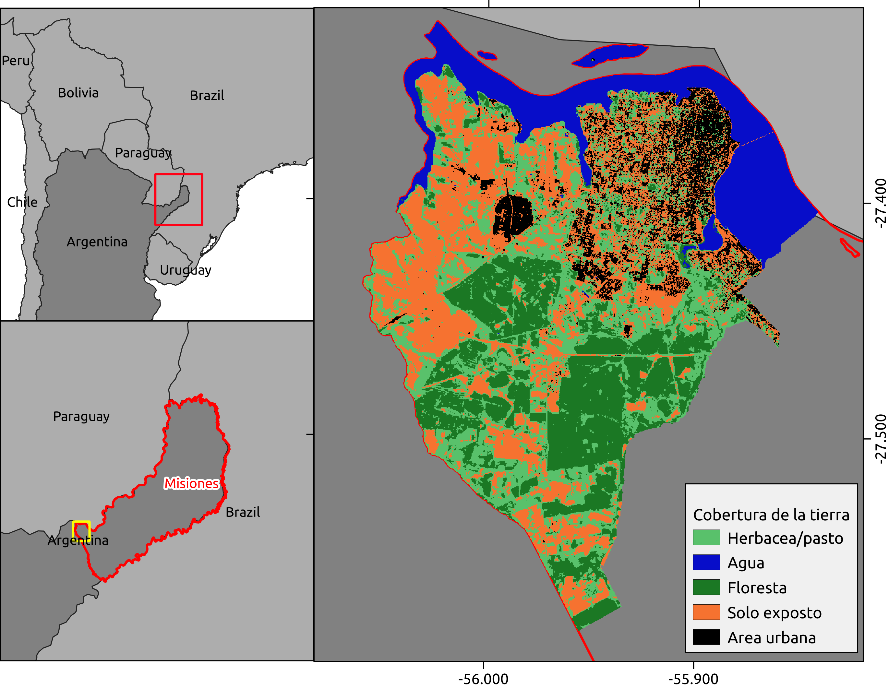

```{r setup, include=FALSE}
knitr::opts_chunk$set(echo = TRUE)
library(RStoolbox)
```

## Introducción  

En el presente informe se pretende plasmar los conocimientos adquiridos en el curso-taller **"Análisis de islas de calor urbano empleando el paquete LSTtools en R"** a cargo del Dr. Richard Lemoine-Rodriguez.

La idea es explorar las hrramientas y análsis sin mucha preocupación con su rigor científico pero de alguna forma ya ir identificando potencialidades y lpimites en el uso de herramientas para análisis de islas de calor urbano para la identificación de servicios ambientales. En este caso, los servicios ambientales de las forestas por el mantenimiento de condiciones favorables de temperatura a la población.

Ya que no dispongo de todos los materiales para el análsisis completo, buscaré desarrrollar los materiales que sean necesário y que agreguen conocimientos a los resutados, como por ejemplo, un mapa de cobertura de la tierra.

## Descripción del área y ciudad de estudio

En el presente estudio, se hará un análisis para el municipio de Posadas, localizado en la provincia de Misiones - Argentina \ref{mapaLocalizacao}. Dicha provincia es también conocida como "mesopotamia" de Argentina ya que la misma se encuentra limitada por los dos ríos más inportantes en escala regional: el rio Paraná y el rio Uruguay. Posadas, en este sentido está ubicada en las orillas del rio Paraná en el límite Argentina/Paraguay en la región sur de la provincia.




Se trata de un área de clima subtropial sin estación seca pero por su ubicación, Posadas se encuentra en área de transición vegetacional de vegetación densa hacia espinales.

## Materiales

### datos satelitales:
```{r metadatosL8, echo=FALSE}
# Leer metadata
m <- list.files(path ="./raster/LC08_L1TP_224079_20200518_20200527_01_T1", pattern ="_MTL.txt$", recursive = TRUE, full.names = TRUE)
m <- readMeta(m)
```

Para el presente estudio se utilizó el sensor `r m$sensor[1]` del  satelite `r m$SATELLITE[1]` para la fecha `r m$ACQUISITION_DATE[1]` y cena path/row `r m$PATH_ROW[1]`/`r m$PATH_ROW[2]`.

Esta misma imagen fue utilizada para el análisis de cobertura de la tierra bien como para el análisis de islas de calor urbano.

## Métodos
El primer paso que se hizo fue el preprocesamiento ya que el resultado del mismo será utilizado en todos los análisis. El miso fue desarrollado a partir del script *01_proprocessing* ubicado en la carpeta 'scripts'.

### Preprocesamiento
1. Corrección
1. Indices espectrales
  1. NDVI;
  1. NDWI;

La idea de usar algunos indices espectrales para apoyar a la clasificación de la cobertura de la tierra y análisis de servicios ambientales se justifica pela presencia de áreas de foresta densa en la región, por eso el uso del NDVI, y presencia del rioi Paraná, justificando el uso del NDWI.

### Clasificación cobertura de la tierra
Los pasos desarrollados fueron:

1. Definición de cantidad de clases;
1. entrenamiento del modelo Kmeans
1. Predicción

Por prueba y error se definió la classificación de cobertura de la tierra en 5 clases distantas (\ref{cobtierra}):

1. Herbacea / pasto
1. Agua
1. Floresta
1. Solo expuesto
1. Area urbana

Vários metodos podrían haber sido utilizados de forma a tornar dicha definición más 'científica'/menos subjetiva, pero por la falta de tiempo, los mismos quedarán para otro momento.



### f


## Resultados

## Interpretaciones y conclusiones


