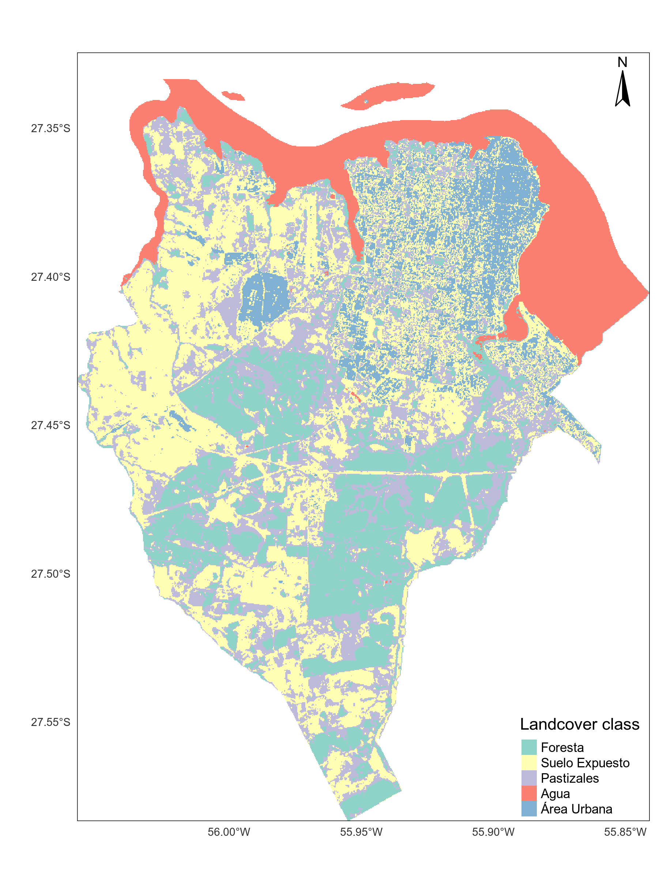
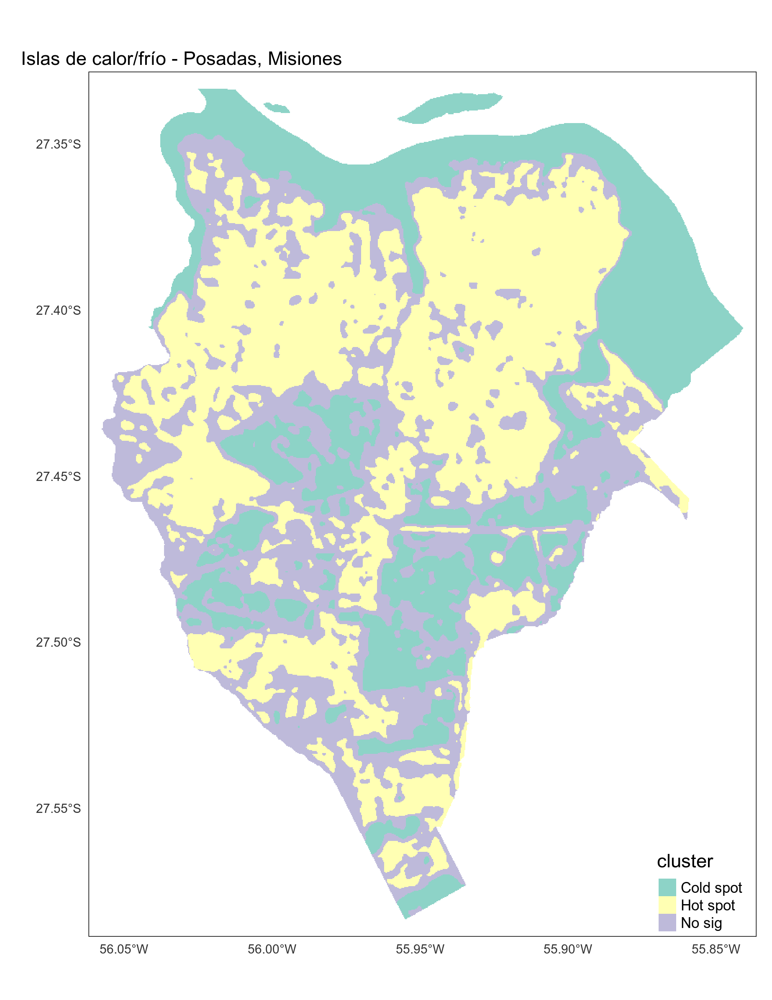

```{r setup, include=FALSE}
knitr::opts_chunk$set(echo = TRUE)
library(RStoolbox)
library(readr)
library(pander)
library(ggplot2)
library(corrplot)
library(magrittr)
```

## Introducción  

En el presente informe se pretende plasmar los conocimientos adquiridos en el curso-taller **"Análisis de islas de calor urbano empleando el paquete `LSTtools` en R"** a cargo del Dr. Richard Lemoine-Rodriguez.

La idea es explorar las herramientas y análsis de islas de calor de manera experimental para, de alguna manera, ya ir identificando potencialidades y límites en el uso de dichos análisis. Lo que se busca es articular la información y conocimiento adiquirido por los análisis de islas de calor con los conceptos de servicios ambientales.

Por servicios ambientales se considera "flujo de bienes y servicios útiles para la sociedad humana", una definición cuñada por @DeGroot. En el presente estudio, se pretende analisar los efectos de las forestas en el servicio ambiental de regulación, más especificamente regulación climática por, supuestamente, favoreces condiciones de temperatura más amena.

Ya que no dispongo de todos los materiales para el análsisis completo, buscaré desarrollarlos siempre que sea necesário o que agreguen conocimientos a los resutados como, por ejemplo, la capa de cobertura del suelo.

## Descripción del área y ciudad de estudio

En el presente estudio, se hará un análisis para el municipio de Posadas, localizado en la provincia de Misiones - Argentina (figura \ref{mapaLocalizacao}). Dicha provincia es también conocida como "mesopotamia" de Argentina ya que la misma se encuentra limitada por los dos ríos más inportantes en escala regional: el rio Paraná y el rio Uruguay. Posadas está ubicada en las orillas del rio Paraná en el límite Argentina/Paraguay en la región sur de la provincia (figura \ref{mapaLocalizacao}).

```{r, echo = FALSE, out.width = "300px", fig.cap="Mapa de localización de Posadas, Misiones - Argentina. \\label{mapaLocalizacao}", fig.align='center'}
knitr::include_graphics("./plots/mapaLocalizacao.png")
```

Se trata de un municipio en área de transición de tres biomas (figura \ref{mapaVegetacion}): *Grasslands & Savannas* (conocido localmente por "Campos y Malezales");  *Tropical & Subtropical Grasslands, Savanna & Shrublands* ("Esteros del Iberá");  *Topical & Subtropical Moist Broadleaf forests* ("Selva Paranaense"). Posee clima subtropial sin estación seca.

```{r, echo = FALSE, out.width = "300px", fig.cap="Mapa de ecorregiones. \\label{mapaVegetacion}", fig.align='center', results='asis'}
knitr::include_graphics("./plots/mapaVegetacion.png")
```

La ciudad de Posdas posee algunas características interesantes como ciudad, ya que posee un centro urbano en las cercanías del río Paraná, pero con la mayor parte de su población viviendo en el perímetro del centro (punto 1, figura \ref{mapaurbano}) y un proceso receinte de expansión hacia el oeste de la ciudad con la construcción de barrios de unidades habitacionales construída por el estado provincial guiando su ocupación hacia dicha dirección (punto 2, figura \ref{mapaurbano}). Analisando los datos del Censo de 2010, para el município, se puede percibiir que, or se tratar de un área en consolidación, todavía figura como un radio del censo más amplio (figura \ref{mapapoblacion}), quizás por no haber, en la fecha del ceso (2010) el mínimo poblacional para la redefinición del radio.

```{r, echo = FALSE, out.width = "200px", fig.cap="Imagen de satélite del municipio de Posadas, indicando su centro urbano (punto uno) y area de expansión a través de la creación de barrios de viviendas planeados (puntos dos). \\label{mapaurbano}", fig.align='center'}

```

```{r, echo = FALSE, out.width = "200px", fig.cap="Mapa de distribución de la población absoluta en el município de Posadas \\label{mapapoblacion}", fig.align='center'}
knitr::include_graphics("./plots/poblacionPosadas.png")
```

~~Para el Calculo de *Surface Heat Urban Island* (SHUI) se va a considerar solamente el barrio de viviendas y su entrono, ya que dado su formato y ubicación, en el centro del territorio, nos permitirá comparar con el entorno. Lo que se complicaría con el centro urbano ya que el mismo está cerca el río Paraná.~~

## Materiales

Todo lo desarrollado en este proyecto está plasmado en el [script 01_WorkFlow.R]("./Scripts/01_WorkFlow.R"), hacendo uso de funciones de paquetes como *raster* [@raster], *rstoolbox* [@rstoolbox], *lstoolbox* [@lstoolbox] dentre otros. Dichas funciones se encuentran en el [script ToolBox]("./Scripts/ToolBox.R").

### Datos satelitales
```{r metadatosL8, echo=FALSE}
# Leer metadata
m <- list.files(path ="./raster/LC08_L1TP_224079_20201212_20201218_01_T1/", pattern ="_MTL.txt$", recursive = TRUE, full.names = TRUE)
m <- readMeta(m)
```

Para el presente estudio se utilizó el sensor `r m$SENSOR` del  satelite `r m$SATELLITE[1]` para la fecha `r m$ACQUISITION_DATE[1]` y cena path/row `r m$PATH_ROW[1]`/`r m$PATH_ROW[2]`.

Esta misma imagen fue utilizada para el análisis de cobertura del suelo bien como para el análisis de islas de calor urbano.

## Métodos

Para este trabajo se desarrolló distintas etapas como el preprocesamiento, la clasificación no supervisadas y estadísticas de islas de calor urbano, descritas a seguir.

### Preprocesamiento
1. Corrección atmosférica y calibración radiométrica;
1. Corrección topográfica:
  1. Mosaico de las cenas DEM 30 metros;
1. Indices espectrales:
  1. NDVI;
  1. EVI;
  1. SAVI;
  1. NDWI;
  1. NDBI;

Para las correcciones atmosféricas, calibración radiométricas y corrección topografica se utilizaron funciones desarrolladas y disponibles en el paquete *rstoolbox* [@rstoolbox]. La corrección atmosférica se utilizaron los métodos de estimación de objetos oscuros y el algorítmo de subtración simples de objetos oscuros (*Simple dark object subtraction* - sdos). Para la corrección topográfica, se descargó de la pagina del [Instituto Geográfico Nacinal de Argentina (IGN)](https://www.ign.gob.ar/category/tem%C3%A1tica/geodesia/mde-ar) las cenas de Modelo Digital de Elevación (DEM, en inglés) que cubre todo el minicípio de Posadas. Para eso, fue necesário hacer el mosaico de las cenas `2757-29` y `2757-30`, bien como proyectar el raster al mismo Sistema de Referencia de Coordenadas (SRC) de la imagem landsat (dichos procedimientos están plasmados en el script [*01_preprocessing_dem*](./Scripts/01_preprocessing_dem.R)).

Para apoyar a la clasificación de la cobertura del suelo y análisis de servicios ambientales, algunos indices espectrales fueron creados, como el NDVI (*Normalized Difference Vegetation Index*), el EVI (*Enhanced Vegetation Index*) y el SAVI (*Soil Adjusted Vegetation Index*) para facilitar la identificación de áreas forestales o con actividad de fotosíntesis. Considerando la presencia de cuerpos de água se utilizó el indice NDWI (*Normalized Difference Water Index*). Ya el indice NDBI (*Normalized Difference Build Index*) fue utilizado para facilitar la identificación de áreas construidas;

Para finalizar se desarrolló la conversión de los valores digitales de la banda *Termal Infrared Sensor (TIR)* en *Top Of Atmosphere Brightness*  con el paquete *lstoolbox* [@lstoolbox].

### Clasificación cobertura del suelo

Considerando los datos satelitales ya preprocesados, se desarrolló las siguintes etapas para la clasificación de cobertura del suelo:

1. Identificación de la catidad óptima de clases;
1. Definición de la cantidad de clases y ejecución del clasificador no supervisado [`Kmeans`](https://es.wikipedia.org/wiki/K-medias);

La definición de la cantidad optima de clases se hizo por análisis del [*Within-Cluster-Sum of Squared Errors (WSS)*](https://medium.com/analytics-vidhya/how-to-determine-the-optimal-k-for-k-means-708505d204eb). De esta forma se pudo identificar que el área sería mejor mapeada con cinco clases por ser la primera cantidad de clases a reduzir el *WSS error* (figura \ref{grafKmeans}) de manera significativa. En la figura \ref{resultadoclass} se presenta el municipio de Posadas con el resultado de clasificación no supervisada de cobertura del suelo. Trás la clasificación, se hizo intepretación visual de las clases creadas. Actividad que permitió, de forma no científica (sin validación en campo), definir las coberturas del suela: 1 - Forestas; 2 - Pasto; 3 - Solo expuesto; 4 - Agua; 5 - Area Urbana;

```{r, echo = FALSE, out.width = "200px", fig.cap="Gráfico con el WSS error estimado por cantidad de clases de cobertura del suelo, idenitifcando, en rojo, el valor optimo de clasificación en cinco clases \\label{grafKmeans}", fig.align='center'}
knitr::include_graphics("./plots/LC08_L1TP_224079_20201212_20201218_01_T1_sdos_clip_Kmeans_clusterAnalysis.png")
```

```{r, echo = FALSE, out.width = "200px", fig.cap="Resultado de la clasificación no supervisada, con las clases: 1 - Foresta; 2 - Pasto; 3 - Solo expuesto; 4 - Agua; 5 - Area urbana; \\label{resultadoclass}", fig.align='center'}

```

### Análisis de Islas de Calor Urbano

Considerando los objetivos del presente trabajo, se desarrolló el calculo de Islas de Calor Urbano Espaciales (*Spatial Urban Heat Island - SUHI*), en base al calculo de emissividad y proporción de vegetación (figura \ref{emissivity}) en el cual se consideraron los valores estándar de los parámetros, para luego calcular el *Land Surface Temperature (LST)* (temperatura de superfície en tierra) (figura \ref{lst}). Ambos procedimientos usando el paquete *lstoolbox* [@lstoolbox].

```{r, echo = FALSE, out.width = "300px", fig.cap="Mapas de emissividad y proporción de vegetación \\label{emissivity}", fig.align='center'}
knitr::include_graphics("./plots/LC08_L1TP_224079_20201212_20201218_01_T1_sdos_clip_em_pveg.png")
```

En base al *LST* (figura \ref{lst}), se calculó estadística de *Hurban Heat Island (UHI)*, el indice de *Heat Island Area (HIA)* [@lstoolbox] teniendo como referencia la cobertura urbana y el indice de *Local Indicators of Spatial Association (LISA)*, usando el indicador G*.

```{r, echo = FALSE, out.width = "200px", fig.cap="Mapas de Land Surface Temperature (LST) para la ciudad de Posadas \\label{lst}", fig.align='center'}
knitr::include_graphics("./plots/LC08_L1TP_224079_20201212_20201218_01_T1_sdos_clip_LST.png")
```

Considerando el objetivo plantado al inicio (entender la relación de la cobertura del suelo con la reguración de la temperatura), se dedicó tiempo en la exploración de los datos e indices mencionados no avanzando tanto en el uso de otros indicadores como el **SHUI**.

## Resultados, interpretaciones y conclusiones

El resultado del calculo de *LST* (figura \ref{lst}) nos llamó la atención para el hecho de las áreas de mayor temperatura no seren, necesariamente las areas clasificadas como urbanas, pero también áreas clasificadas como pasto y suelo expuesto. Llevado por esa curiosidad, busqué identificar si hay correlación del *LST* con los indices espectrales creados (figura \ref{corrIndicesGrafico}).

```{r, echo = FALSE, warning = FALSE, message=FALSE, fig.cap="tabla de correlación entre Land Surface Temperature (LST) y indices espectrales. \\label{corrIndices}", fig.align='center'}
hia.df <- read_csv("./outputs/Hia_specIndexes.csv")
#ggplot(r.df, aes(x = LST, y=SAVI, color = as.factor(landcover))) + geom_point()
hia.df <- hia.df %>% dplyr::select(!landcover)
#pander(cor(hia.df))
```
```{r, echo = FALSE, warning = FALSE, message=FALSE, out.width = "300px", fig.cap="Grafico de correlación entre LST y los distintos indices espectrles. \\label{corrIndicesGrafico}", fig.align='center'}
corrplot(cor(hia.df), type = "lower", is.corr = TRUE, addCoef.col = T)
```

En base a la figura \ref{corrIndicesGrafico} se pudo identificar que el *LST* tiene correlación positiva con el indice de NDBI, indice espectral creado para resaltar areas de contrucción urbana, y negativa con el NDWI, indice creado para evidenciar áreas con mayor presencia de agua. Vale mencionar que dichos indices son diametralmente opuestos ya que ambos usan las mismas bandas: infrarojo de ondas cortas (*shortwave infrared* - SWIR) y e infrarojo (*near infrared* - NIR) en posiciones opuestas en el cáculo de diferencia normalizada: $NWDI = \frac{(NIR - SWIR)}{NIR + SWIR}$ minetras el $NWDI = \frac{(SWIR - NIR)}{SWIR + NIR}$

Un punto a mejorar sería buscar un indice espectral específico para suelo expuesto que nos permita estimar la correlación entre el *LST* y dicha clase de cobertura del suelo.

```{r, echo=FALSE}
tbl <- read.csv("./outputs/LC08_L1TP_224079_20201212_20201218_01_T1_sdos_clip_uhi_stats.csv")
```

Analisando las estadísticas de *UHI* (tabla \ref{tab:MyLabel}), se pudo identificar que, apra la cena utilizada, la clase `r tbl[which(tbl$min == min(tbl$min)), 'clase']` presentó el valor mínimo de `r tbl[which(tbl$min == min(tbl$min)), 'min']` grados de temperatura. Ya la clase `r tbl[which(tbl$max == max(tbl$max)), 'clase']` presentó el mayor valor de temperatura con `r tbl[which(tbl$max == max(tbl$max)), 'max']` grados. Este ultimo resultado confirma lo mencionado inicialmente: las áreas de mayor temperatura de superficie no fueron, necesariamente, áreas clasificadas como "área urbana". Puede ser que el hecho del suelo de Misiones, y a su vez, Posadas, ser de tipo "rojo profundo", con prevalecia de *Ultisoles*, sea responsable por esa características. Creo ser un punto importante a ser mejor investigado: 1. si esa tendencia de posse mayores temperaturas máximos en clases de suelo expuesto de mantinen en el tiempo; 2. A que medida la caracterización y la clasificación del suelo contribuye a esa tendencia.

Con relación a la magnitud (tabla \ref{tab:MyLabel}), que mide el rango de variación entre el valor promedio de temperaturas en areas urbanas y las demás clases, se evidencía un cámbio de hasta `r tbl[which(tbl$magnitud == max(tbl[-1, "magnitud"])), 'magnitud']` grados en relación a áreas de agua, seguido de áreas forestales con un rango de hasta `r sort(tbl$magnitud, decreasing = T)[2]` grados. Valdría la pena hacer una investigación con serie temporal para confirmar si esa tendencia se mantiene para que se pueda, de hecho, afirmar las áreas forestales no solo como mantenedoras de temperatura más amena, si no también identificar el promedio de temperatura en grados que se llega a manteres dichas áreas. Quizás en el futuro, se podría, inclusive, estimar el gasto en anergía para llegar al mismo valor con el uso de aire acondicionado, para llamar atención hacia los serivios ecosistémicos de las áreas forestales.

```{r uhiTable, echo=FALSE, results='asis'}
pander(tbl %>% dplyr::select(clase,min:magnitud), caption = "Iris with kable \\label{tab:MyLabel}")
```

```{r, echo=FALSE}
hia <- read_rds("./outputs/LC08_L1TP_224079_20201212_20201218_01_T1_sdos_clip_hia")
```

El calculo de *HIA* fue desarrollado considerando solamente las áreas de clase urbana, aunque se pueda percibir en la figura \ref{lst} que las áreas de mayor temperatura no están restritas a áreas de dicha clase. El Indice de HIA retornó como limitar de temperatura `r hia[[4]]` grados, con valor promedio de `r hia[[2]]` grados y totalizando `r hia[[5]]` hectareas, presentadas en la figura \ref{hiamap}.

```{r, echo = FALSE, out.width = "300px", fig.cap="Mapa del análisis Heat Island Area (HIA) \\label{hiamap}", fig.align='center'}

```

EN el mapa de HIA (\ref{hiamap}) deja en evidencia algunos puntos de la ciudad como los barrios de vivienda que se están consolidando en la región oeste del municipio (punto 1, figura \ref{hiamapMod}). Lo inesperado fue la ausencia del centro centro urbano (punto 1, figura \ref{mapaurbano}), el cual se imaginaba ser mucho más significativo en términos de calor. Habría que investigar más al respecto pero, el hecho del centro urbano (punto 1, figura \ref{mapaurbano}) estar ubicado cerca el río Paraná, lo deje con una temperatura más baja si comparado con los áreas de expansión urbana (punto 2, figura \ref{mapaurbano}). Otros puntos interesantes de se mencionar son: el hipermercado libertad junto a la terminal de omnibus y parte de la Avenida Quaranta (Ruta 12) (punto 2, figura \ref{hiamapMod}), Avenida Uruguay (punto 3, figura \ref{hiamapMod}) y la rotonda de la Avenida Costanera y Mitre (punto 4, figura \ref{hiamapMod}).

```{r, echo = FALSE, out.width = "300px", fig.cap="Mapa del análisis Heat Island Area (HIA) con algunos puntos de atención. \\label{hiamapMod}", fig.align='center'}
knitr::include_graphics("./plots/LC08_L1TP_224079_20201212_20201218_01_T1_sdos_clip_hiaMapMod.png")
```
El análisis de *Local Indicators of spatial Association (LISA)* fue hecho con el indicador *Getis-Ord Gi\**, con los parâmetros estándares del paquete *LSToolBox* \ref{lstoolbox} (70 metros de distáncia) y en base al resultado, se calculó las áreas de correlación positiva, negativa y aquellas con resultados no significativos (figura \ref{correlacionG}) en base al valor *z.score* y l acorrección *False Discovery Rate (FDR)*, la cual reduce el valor de corte del p-valor. Se usó el valor de 0.05 como el valor para rechazar la hipotesis nula.

Con el resultado del análisis de correlación *G*\* se puede percibir que, para la fecha de la imagen analisada y para el municipio de Posadas, las áreas clasificadas como urbanas y de suelo expuesto tuvieron la tendencia de formar agrupamientos de puntos cálidos (*hot spot*). Además de eso, llama la atención el hecho de que además de las áreas forestales, el río Paraná se configura como un área dissipador de calor, o como e se costumbra llamar, islas de calor negativa (*sink island*).

```{r, echo = FALSE, out.width = "200px", fig.cap="Mapa correlación espacial a partir de indice G*, indicando áreas de cold/hot spot y áreas sin resultado de correlación signaficativo. \\label{correlacionG}", fig.align='center'}

```

## Consideraciones finales

Los análsisis desarrollados para este informe se mostraron como un buen ejercício exploratório de las herramientas disponíbles permitiendo idenitificar en este protorípo, vários puntos importante a seren mejor investigados. Identifico como puntos a seren mejorados para un proyecto de investigación:

1. Revisión bibliográfico al respecto del fenómeno en cuestión bien como de las principales herramientas utilizadas, de forma a permitir el ajuste de los parámetros, cuando posible, bien como la toma de decisión por abordajes distintos con argumentación científica.
1. Validación de la clasificación de cobertura de suela realizada;
1. Validar la información de temperatura del sensore TIR con información de la estación meteorológica del aeropuerto de la ciudad, si posble;
1. Investigar un posible indice espectral para mejor mapear las áreas de suelo expuesto y que nos permite identificar posible relación de este tipo de cobertura con la temperatura de superfície;
1. Realisar, si posible, el análisis en una serie temporal para identificar si la tendencia encontrada en este ejercício es verdadero en la serie temporal.

Pero más allá de eso se pudo entender los procedimeintos y algunos resultados se presentaron pertinente como la diferencia promedia de temperatura entre areas forestales y áreas urbanas y la magnitud de diferencia entre ellas.

# References