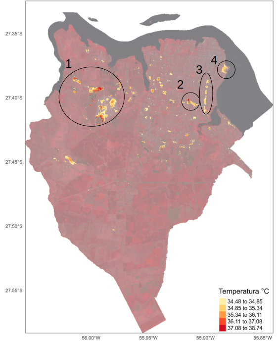

```{r setup, include=FALSE}
knitr::opts_chunk$set(echo = TRUE)
library(RStoolbox)
library(readr)
library(pander)
library(ggplot2)
library(corrplot)
library(magrittr)
```

## Introducción  

En el presente informe se pretende plasmar los conocimientos adquiridos en el curso-taller **"Análisis de islas de calor urbano empleando el paquete `LSTtools` en R"** a cargo del Dr. Richard Lemoine-Rodriguez.

La idea es explorar las herramientas y análsis de islas de calor de manera experimental para, de alguna manera, identificar potencialidades y límites en el uso de dichos análisis. Lo que se busca es articular la información y conocimiento adiquirido por los análisis de islas de calor con los conocimientos de la ciudad y entenderla bajouna otra mirada: Como las diferentes cobertural del suelo están relacionadas a la temperatura observada por teledetección. Se buscará hacer una aproximación con el concepto de servicios ambientales, sin todavía preocuparse tanto en la validación científica de dicha relación (cobertura del suelo, temperatura observada, servicios ambientales). Por servicios ambientales se considera "flujo de bienes y servicios útiles para la sociedad humana", una definición cuñada por @DeGroot. Hacia futuro, en una investigación más elaborado y con herramientas de validación, se buscará identificar los efectos de las forestas en el servicio ambiental de regulación climática por, supuestamente, favoreces condiciones de temperatura más amena.

Ya que no dispongo de todos los materiales para el análsisis completo, buscaré desarrollarlos siempre que sea necesárío o que agreguen conocimientos a los resutados como, por ejemplo, la capa de cobertura del suelo.

## Descripción del área y ciudad de estudio

En el presente estudio, se hará un análisis para el municipio de Posadas, localizado en la provincia de Misiones - Argentina (figura \ref{mapaLocalizacao}). Dicha provincia es también conocida como "Mesopotamia" de Argentina ya que la misma se encuentra limitada por los dos ríos más importantes en escala regional: el río Paraná y el río Uruguay. Posadas está ubicada a orillas del río Paraná en el límite Argentina/Paraguay en la región sur de la provincia (figura \ref{mapaLocalizacao}).

```{r, echo = FALSE, out.width = "300px", fig.cap="Mapa de localización de Posadas, Misiones - Argentina. \\label{mapaLocalizacao}", fig.align='center'}

```

Se trata de un municipio en área de transición de tres biomas (figura \ref{mapaVegetacion}): *Grasslands & Savannas* (conocido localmente por "Campos y Malezales");  *Tropical & Subtropical Grasslands, Savanna & Shrublands* ("Esteros del Iberá");  *Topical & Subtropical Moist Broadleaf forests* ("Selva Paranaense"). Posee clima subtropial sin estación seca.

```{r, echo = FALSE, out.width = "300px", fig.cap="Mapa de ecorregiones. \\label{mapaVegetacion}", fig.align='center', results='asis'}

```

La ciudad de Posadas posee algunas características interesantes como ciudad, ya que posee un centro urbano en las cercanías del río Paraná (punto 1, figura \ref{mapaurbano}), pero con la mayor parte de su población viviendo en el perímetro del centro y un proceso reciente de expansión urbana hacia el oeste de la ciudad con la construcción de barríos de unidades habitacionales edificados por el estado provincial guiando su ocupación hacia dicha dirección (punto 2, figura \ref{mapaurbano}). Analizando los datos del Censo del 2010, para el municipio, se puede percibir que, dichos barrios  que marcan la expansión urbana más reciente todavía figura como un radio del censo más amplio (figura \ref{mapapoblacion}), quizás por no haber, en la fecha del ceso (2010) el mínimo poblacional para la redefinición del radio.

```{r, echo = FALSE, out.width = "200px", fig.cap="Imagen de satélite del municipio de Posadas, indicando su centro urbano (punto uno) y área de expansión a través de la creación de barríos de viviendas planeados (puntos dos). \\label{mapaurbano}", fig.align='center'}
knitr::include_graphics("./plots/mapalocalizacao_detallado.png")
```

```{r, echo = FALSE, out.width = "200px", fig.cap="Mapa de distribución de la población absoluta en el municipio de Posadas \\label{mapapoblacion}", fig.align='center'}

```

## Materiales

Todo lo desarrollado en este proyecto está plasmado en el [script 01_WorkFlow.R]("./Scripts/01_WorkFlow.R"), haciendo uso de funciones de paquetes como *raster* [@raster], *rstoolbox* [@rstoolbox], *lstoolbox* [@lstoolbox] entre otros. Dichas funciones se encuentran en el [script ToolBox]("./Scripts/ToolBox.R").

### Datos satelitales
```{r metadatosL8, echo=FALSE}
# Leer metadata
m <- list.files(path ="./raster/LC08_L1TP_224079_20201212_20201218_01_T1/", pattern ="_MTL.txt$", recursive = TRUE, full.names = TRUE)
m <- readMeta(m)
```

Para el presente estudio se utilizó el sensor `r m$SENSOR` del  satélite `r m$SATELLITE[1]` para la fecha `r m$ACQUISITION_DATE[1]` y cena path/row `r m$PATH_ROW[1]`/`r m$PATH_ROW[2]`.

Esta misma imagen fue utilizada para el análisis de cobertura del suelo así como para el análisis de islas de calor urbano.

## Métodos

Para este trabajo se desarrollaron distintas etapas como el preprocesamiento, la clasificación no supervisada y estadísticas de islas de calor urbano, descritas a continuación.

### Preprocesamiento
1. Corrección atmosférica y calibración radiométrica;
1. Corrección topográfica:
    - Mosaico de las cenas DEM 30 metros;
1. índices espectrales:
    - NDVI;
    - EVI;
    - SAVI;
    - NDWI;
    - NDBI;

Para las correcciones atmosféricas, calibración radiométricas y corrección topográfica se utilizaron funciones desarrolladas y disponibles en el paquete *rstoolbox* [@rstoolbox]. Para la corrección atmosférica se utilizaron los métodos de estimación de objetos oscuros y el algoritmo de *Simple dark object subtraction* - sdos. Para la corrección topográfica, se descargó de la página del [Instituto Geográfico Nacional de Argentina (IGN)](https://www.ign.gob.ar/category/tem%C3%A1tica/geodesia/mde-ar) las cenas de Modelo Digital de Elevación (DEM, en inglés) que cubre todo el municipio de Posadas. Para eso, fue necesarío hacer el mosaico de las cenas `2757-29` y `2757-30`, además de proyectar el ráster al mismo Sistema de Referencia de Coordenadas (SRC) de la imagen landsat (dichos procedimientos están plasmados en el script [*01_preprocessing_dem*](./Scripts/01_preprocessing_dem.R)).

Para apoyar a la clasificación de la cobertura del suelo y análisis de servicios ambientales, algunos índices espectrales fueron creados, como el NDVI (*Normalized Difference Vegetation Index*), el EVI (*Enhanced Vegetation Index*) y el SAVI (*Soil Adjusted Vegetation Index*) para facilitar la identificación de áreas forestales o con actividad de fotosíntesis. Considerando la presencia de cuerpos de agua se utilizó el índice NDWI (*Normalized Difference Water Index*). Ya el índice NDBI (*Normalized Difference Build Index*) fue utilizado para facilitar la identificación de áreas construidas;

Para finalizar se desarrollaron la conversión de los valores digitales de la banda *Termal Infrared Sensor (TIR)* en *Top Of Atmosphere Brightness*  con el paquete *lstoolbox* [@lstoolbox].

### Clasificación cobertura del suelo

Considerando los datos satelitales ya preprocesados, se desarrollaron las siguientes etapas para la clasificación de cobertura del suelo:

1. Identificación de la cantidad óptima de clases;
1. Definición de la cantidad de clases y ejecución del clasificador no supervisado [`Kmeans`](https://es.wikipedia.org/wiki/K-medias);

La definición de la cantidad óptima de clases se hizo a través del análisis [*Within-Cluster-Sum of Squared Errors (WSS)*](https://medium.com/analytics-vidhya/how-to-determine-the-optimal-k-for-k-means-708505d204eb). De esta forma se pudo identificar que el área sería mejor mapeada con cinco clases por ser la primera cantidad de clases a reducir el *WSS error* (figura \ref{grafKmeans}) de manera significativa. En la figura \ref{resultadoclass} se presenta el municipio de Posadas con el resultado de clasificación no supervisada de cobertura del suelo. Luego de la clasificación, se hizo la intepretación visual de las clases creadas. Actividad que permitió, de forma no científica (sin validación en campo), definir las coberturas del suelo: 1 - Florestas; 2 - Suelo Expuesto; 3 - Pastizales; 4 - Agua; 5 - Área Urbana;

```{r, echo = FALSE, out.width = "200px", fig.cap="Gráfico con el WSS error estimado por cantidad de clases de cobertura del suelo, identifcando, en rojo, el valor óptimo de clasificación en cinco clases \\label{grafKmeans}", fig.align='center'}

```

```{r, echo = FALSE, out.width = "200px", fig.cap="Resultado de la clasificación no supervisada, con las clases: 1 - Floresta; 2 - Pastizales; 3 - Suelo Expuesto; 4 - Agua; 5 - Área Urbana; \\label{resultadoclass}", fig.align='center'}
knitr::include_graphics("./plots/LC08_L1TP_224079_20201212_20201218_01_T1_sdos_clip_landcover.png")
```

### Análisis de Islas de Calor Urbano

Considerando los objetivos del presente trabajo, se desarrollaron el cálculo de Islas de Calor Urbano Espaciales (*Spatial Urban Heat Island - SUHI*), en base al cálculo de emisividad y proporción de vegetación (figura \ref{emissivity}) en el cual se consideraron los valores estándar (predefinidos) de los parámetros, para luego calcular el *Land Surface Temperature (LST)* (temperatura de superficie en tierra) (figura \ref{lst}). Ambos procedimientos usando el paquete *lstoolbox* [@lstoolbox].

```{r, echo = FALSE, out.width = "300px", fig.cap="Mapas de emisividad y proporción de vegetación \\label{emissivity}", fig.align='center'}

```

En base al *LST* (figura \ref{lst}), se calculó estadística de *Hurban Heat Island (UHI)*, el índice de *Heat Island Area (HIA)* [@lstoolbox] teniendo como referencia la cobertura urbana y el índice de *Local Indicators of Spatial Association (LISA)*, usando el indicador G*.

```{r, echo = FALSE, out.width = "200px", fig.cap="Mapas de Land Surface Temperature (LST) para la ciudad de Posadas \\label{lst}", fig.align='center'}
knitr::include_graphics("./plots/LC08_L1TP_224079_20201212_20201218_01_T1_sdos_clip_LST.png")
```

Buscando entender más al respecto de los resultados obtenidos y su relación con las distintas clases de cobertura del suelo, se dedicó más tiempo en la exploración de los datos e índices mencionados en detrimento de la aplicación de análisis más avanzados como, por ejemplo el cálculo del *SHUI*.

## Resultados, interpretaciones y conclusiones

El resultado del cáculo de *LST* (figura \ref{lst}) nos llamó la atención por el hecho de las áreas de mayor temperatura no seren, necesariamente, las areas clasificadas como urbanas, pero también áreas clasificadas como Pastizales y Suelo Expuesto. Llevado por esa curíosidad, busqué identificar si hay correlación del *LST* con los índices espectrales creados (figura \ref{corríndicesGrafico}).

```{r, echo = FALSE, warning = FALSE, message=FALSE, fig.cap="tabla de correlación entre Land Surface Temperature (LST) y índices espectrales. \\label{corríndices}", fig.align='center'}
hia.df <- read_csv("./outputs/Hia_specIndexes.csv")
#ggplot(r.df, aes(x = LST, y=SAVI, color = as.factor(landcover))) + geom_point()
hia.df <- hia.df %>% dplyr::select(!landcover)
#pander(cor(hia.df))
```
```{r, echo = FALSE, warning = FALSE, message=FALSE, out.width = "300px", fig.cap="Gráfico de correlación entre LST y los distintos índices espectrales. \\label{corríndicesGrafico}", fig.align='center'}
corrplot(cor(hia.df), type = "lower", is.corr = TRUE, addCoef.col = T)
```

En base a la figura \ref{corríndicesGrafico} se pudo identificar que el *LST* tiene correlación positiva con el índice de NDBI, índice espectral creado para resaltar areas de construcción urbana, y negativa con el NDWI, índice creado para evidenciar áreas con mayor presencia de agua. Vale mencionar que dichos índices son diametralmente opuestos ya que ambos usan las mismas bandas: infrarrojo de ondas cortas (*shortwave infrared* - SWIR) y el infrarrojo (*near infrared* - NIR) en posiciones opuestas en el cáculo de diferencia normalizada: $NWDI = \frac{(NIR - SWIR)}{NIR + SWIR}$ mientras el $NWDI = \frac{(SWIR - NIR)}{SWIR + NIR}$. Un punto a mejorar sería buscar un índice espectral que permita resaltar áreas de Suelo Expuesto y que nos permita estimar la correlación entre el *LST* y dicho índice.

```{r, echo=FALSE}
tbl <- read.csv("./outputs/LC08_L1TP_224079_20201212_20201218_01_T1_sdos_clip_uhi_stats.csv")
```

Analizando las estadísticas de *UHI* (tabla \ref{tab:MyLabel}), se pudo identificar que, para la cena utilizada, la clase `r tbl[which(tbl$min == min(tbl$min)), 'clase']` presentó el menor valor mínimo de temperatura, con `r tbl[which(tbl$min == min(tbl$min)), 'min']` grados. Ya la clase `r tbl[which(tbl$max == max(tbl$max)), 'clase']` presentó el mayor valor de temperatura máxima con `r tbl[which(tbl$max == max(tbl$max)), 'max']` grados. Este último resultado confirma lo mencionado inicialmente: áreas de mayor temperatura de superficie no fueron, necesariamente, áreas clasificadas como "Área Urbana". Puede ser que por el hecho del suelo de Misiones, y a su vez, Posadas, ser de tipo "rojo profundo", con prevalencia de *Ultisoles*, sea responsable por esa características. Creo que este es un punto importante a ser mejor investigado: 1. si esa tendencia de poseer mayores temperaturas máximas en clases de Suelo Expuesto se mantiene en un análisis multitemporal; 2. a que medida la caracterización y la clasificación del suelo contribuye a esa tendencia.

Con relación a la magnitud (tabla \ref{tab:MyLabel}), que mide el rango de variación de cada clase (valor máximo menos el valor mínimo de temperatura), se evidencia en áreas de `r tbl[which(tbl$magnitud == max(tbl[-1, "magnitud"])), 'clase']` el mayor rango de variación, totalizando `r tbl[which(tbl$magnitud == max(tbl[-1, "magnitud"])), 'magnitud']` grados. Las áreas de `r tbl[sort(tbl$magnitud, decreasing = T, index.return = T)$ix[2], 'clase']` se presentan como la clase con el segundo mayor valor de variación de temperatura con un rango de `r sort(tbl$magnitud, decreasing = T)[2]` grados. Valdría la pena hacer una investigación con serie temporal para confirmar si esa tendencia se mantiene para que se pueda, argumentar las áreas de cobertura florestal como proveedores de servicios ambientales de regulación climática. Quizás en el futuro, se podría, incluso, estimar el gasto en energía para llegar a la misma temperatura con el uso de aire acondicionado, para llamar atención hacia los servicios ecosistémicos de las áreas florestales.

```{r uhiTable, echo=FALSE, results='asis'}
pander(tbl %>% dplyr::select(clase,min:magnitud), caption = "Etadísticas de UHI identificando para cada clase de cobertura del suelo los valores mínimos, máximos, medios y desvio estándar, así como la diferencia entre el valor promedio en relación al promedio de la clase urbana, y la magnitud de cambio de cada clase (su valor máximo menos el valor mínimo de temperatura)  \\label{tab:MyLabel}")
```

```{r, echo=FALSE}
hia <- read_rds("./outputs/LC08_L1TP_224079_20201212_20201218_01_T1_sdos_clip_hia")
```

El cáculo de *HIA* fue desarrollado considerando solamente las áreas de clase urbana, aunque se puede percibir en la figura \ref{lst} que las áreas de mayor temperatura no están restrictas a áreas de dicha clase. El índice de HIA retornó como limitar de temperatura `r hia[[4]]` grados, con valor promedio de `r hia[[2]]` grados y totalizando `r hia[[5]]` hectáreas, presentadas en la figura \ref{hiamap}.

```{r, echo = FALSE, out.width = "300px", fig.cap="Mapa del análisis Heat Island Area (HIA) \\label{hiamap}", fig.align='center'}
knitr::include_graphics("./plots/LC08_L1TP_224079_20201212_20201218_01_T1_sdos_clip_hiaMap.png")
```

El mapa de HIA (figura \ref{hiamap}) deja en evidencia algunos puntos de la ciudad como los barríos de vivienda que se están consolidando en la región oeste del municipio (punto 1, figura \ref{hiamapMod}). Lo inesperado fue la ausencia del centro urbano (punto 1, figura \ref{mapaurbano}), el cual se presumía ser tan significativo en términos de temperatura como las nuevas áreas de expansión urbana. Habría que investigar más al respecto, pero el hecho del centro urbano (punto 1, figura \ref{mapaurbano}) estar ubicado cerca el río Paraná puede estar influenciando en su temperatura, manteniendo más baja si se compara con las nuevas áreas de expansión urbana (punto 2, figura \ref{mapaurbano}). Otros puntos interesantes para mencionar son: el hipermercado libertad junto a la terminal de ómnibus y parte de la Avenida Quaranta (Ruta 12) (punto 2, figura \ref{hiamapMod}), Avenida Uruguay (punto 3, figura \ref{hiamapMod}) y la rotonda de la Avenida Costanera y Mitre (punto 4, figura \ref{hiamapMod}).

```{r, echo = FALSE, out.width = "300px", fig.cap="Mapa del análisis Heat Island Area (HIA) con algunos puntos de atención. \\label{hiamapMod}", fig.align='center'}

```

El análisis de *Local Indicators of spatial Association (LISA)* fue hecho con el indicador *Getis-Ord Gi\**, con los parámetros estándares del paquete *LSToolBox* [@lstoolbox] (70 metros de distancia) y en base al resultado, se calcularon las áreas de correlación positiva, negativa y aquellas con resultados no significativos (figura \ref{correlacionG}) en base al valor *z.score* y la corrección *False Discovery Rate (FDR)*, la cual reduce el valor de corte del p-valor. Se usó el valor de 0.05 como el valor para rechazar la hipótesis nula.

Con el resultado del análisis de correlación *G*\* se puede percibir que, para la fecha de la imagen analizada y para el municipio de Posadas, las áreas clasificadas como urbanas y de Suelo Expuesto tuvieron la tendencia a formar agrupamientos de puntos cálidos (*hot spot*). Además de eso, llama la atención el hecho de que además de las áreas florestales, el río Paraná se configura como un área disipadora de calor, o como se acostumbra a llamar, islas de calor negativa (*sink island*).

```{r, echo = FALSE, out.width = "200px", fig.cap="Mapa correlación espacial a partir del índice G*, indicando áreas de cold/hot spot y áreas sin resultado de correlación significativo. \\label{correlacionG}", fig.align='center'}
knitr::include_graphics("./plots/LC08_L1TP_224079_20201212_20201218_01_T1_sdos_clip_AreasCorrelacionG.png")
```

## Consideraciones finales

Los análisis desarrollados para este informe se mostraron como un ejercicio exploratorío y de aproximación necesarios hacia las herramientas disponíbles para el análisis de islas de calor urbano. Aunque se trata de un ejercicio inicial, se pudo identificar, en este prototípo, varios puntos importante a ser mejor investigados. Identifico como puntos a ser mejorados para un proyecto de investigación:

1. Revisión bibliográfica al respecto del fenómeno en cuestión así como de las principales herramientas utilizadas, de forma a permitir el ajuste de los parámetros, cuando sea posible, bien como la toma de decisión por abordajes distintos con argumentación científica.
1. Validación de la clasificación de cobertura del suelo realizada;
1. Validación de la información de temperatura del sensor *TIR* con información de la estación meteorológica del aeropuerto de la ciudad, si es posible;
1. Investigar un posible índice espectral para mapear mejor las áreas de Suelo Expuesto y que nos permita identificar posible relación de este tipo de cobertura con la temperatura de superficie;
1. Realizar, si posible, el análisis en serie temporal para identificar si la tendencia encontrada en este ejercicio es verdadero en un contexto de medio/largo plazo histórico.

# References